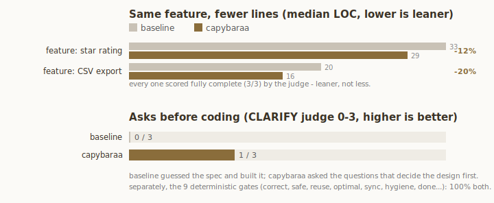

<p align="center">
  <picture>
    <source media="(prefers-color-scheme: dark)" srcset="assets/capybara_nobg.png">
    
  </picture>
</p>

<h1 align="center">Capybaraa</h1>

<p align="center">
  <em>The chillest senior dev in the swamp. Doesn't panic, doesn't over-build. Asks first, ships clean, leaves.</em>
</p>

<p align="center">
  
  
  
  
  
</p>

<p align="center">
  <strong>~10% fewer output tokens</strong> and <strong>~30% less code</strong> than a bare agent, fully complete &middot; plus the questions ponytail skips
</p>
<p align="center">
  <sub>Sonnet 4.6, four arms (bare agent, caveman, ponytail, capybaraa), n=2, directional. <a href="https://github.com/DietrichGebert/ponytail">ponytail</a> is leaner still on pure lines; capybaraa keeps validation and accessibility and adds an ASCII question when the spec is ambiguous. <a href="benchmarks/results/2026-06-26-sonnet-lean.md">full numbers</a> &middot; <a href="benchmarks/agentic/">method</a></sub>
</p>

You know the type. Unbothered, has seen every framework rise and fall and didn't migrate to any of them. You hand over a vague ticket and fifty lines of someone's first draft. He reads it, asks the two questions that actually matter, draws a little box-and-arrow on a napkin, and replaces the whole thing with the part you needed.

Capybaraa puts that habit inside Claude Code: ponytail's lean discipline plus a few things it skips. Ask the deciding question before building the wrong thing, pick the right data structure, write fewer comments, and sync the docs after a change. The ruleset stays tiny on purpose, a plugin that preaches lean while injecting a wall of rules every turn is the irony it avoids.

## Before / after

The ticket: "add user settings persistence."

Claude can already ask good questions here, that's what plan mode is for. But in a plain run it tends to guess the spec and start building, and you find out it guessed wrong once it is written. In our benchmark, on a ticket like this the bare agent wrote ~300 lines of a settings panel nobody specified; capybaraa wrote zero and asked first.

**Capybaraa makes asking-first the default**, even outside plan mode, and sharpens it: it goes straight to the few questions that actually decide the design and draws the choices so the tradeoff is obvious at a glance:

```
🦫 two questions before I touch code:

   ┌── settings ──┐
   │ theme        │   store where?   local / your API / both
   │ language     │   per-device, or synced to the account?
   └──────────────┘

   1. just these two fields now, or more coming?
   2. per-device, or synced?

   edge cases I'll handle: no-JS fallback, unknown saved value, first load.
```

Then it builds the smallest thing that fits your answers and stops. No invented spec, no files you didn't need, nothing left half-done. The rest is plain lean: reuse what's there, the right data structure, few comments, and a sync of the docs after.

That is the whole pitch: **ask when it's ambiguous, build lean, leave it clean.** The rest of this README is how it does that, and the numbers that show it.

## Numbers

We measured it instead of asserting it. The [agentic benchmark](benchmarks/agentic/) runs real headless Claude Code sessions (`claude -p`) in throwaway workspaces and puts capybaraa next to its honest peers: a **bare agent** (no plugin), **caveman** (a prose-compression skill), and **ponytail** (the pure-minimal plugin, loaded live). Same model, same task, same seed; the only change is the arm.

<p align="center">
  
</p>

| vs the bare baseline | lines of code | output tokens | cost | time | complete |
|---|--:|--:|--:|--:|--:|
| caveman | 99% | 95% | 100% | 93% | 3/3 |
| **ponytail** | **43%** | **75%** | 104% | 94% | 3/3 |
| **capybaraa** | 69% | 90% | 105% | 98% | 3/3 |

Read it straight, no spin:

**1. capybaraa spends fewer tokens than the bare agent.** It writes **~30% less code** and **~10% fewer output tokens**, and finishes a hair faster, all while scoring fully complete (3/3). The earlier version of this plugin tied the bare agent on output and cost 16% more; cutting the ruleset to ponytail size is what turned that around.

**2. ponytail is the leanest on raw lines, by a lot.** That is its single axis and it wins it (43% of baseline code). capybaraa lands between the bare agent and ponytail, the honest place for a tool that also keeps validation, error handling, and accessibility, and asks before it builds the wrong thing.

**3. Cost is the one metric still a touch above baseline (+5%).** On tasks this small no injected plugin beats a bare agent on cost: even ponytail is +4%. The injected ruleset is cached and re-read each turn, a few hundred tokens the trivial task can't fully amortize. On bigger tasks the 30% code saving dominates and it flips. We do not claim a cost win.

Honest caveats: a small task set (n=2, three build tasks) on one model, so read it as directional, not a leaderboard. Completeness is an LLM judge (fixed model, temperature 0, published rubric, run with no plugin loaded so no arm grades itself). The ASK habit (questions plus an ASCII sketch on an ambiguous ticket) still ships; it is not benchmarked here, this run is about token efficiency on clear work. [Full writeup and the reproduce commands.](benchmarks/results/2026-06-26-sonnet-lean.md)

## How it works

One source of truth, [`principles/build-instructions.js`](principles/build-instructions.js), injected every session by a `SessionStart` hook and into every subagent by a `SubagentStart` hook. Whether it's on lives in a flag file (`~/.claude/.capybaraa-active`). It is small on purpose, about 440 tokens, so the always-on cost stays near zero.

It is ponytail's lean ladder:

```
 1. does it need to exist?        if speculative, don't build it
 2. already in this codebase?     reuse it
 3. stdlib or the platform?       use it
 4. an installed dependency?      use it
 5. can it be one line?           make it one line
 6. only then                     the least code that works
```

plus five habits, the only things capybaraa adds over plain lean:

| Habit | What it does |
|--------|------------------|
| **ASK** | When the spec is ambiguous, ask the few questions that actually decide the build before writing code, and draw a small ASCII sketch of the options so the tradeoff is concrete. Don't guess the spec; don't ask what the prompt or code already answers. |
| **OPTIMAL** | Right data structure, no needless O(n^2). Correctness and clarity first, no micro-optimizing without a reason. |
| **TERSE** | Few words, few comments. No filler prose, no restating the obvious, no comment the code already says. |
| **CLEAN** | Refactor means replace: rewrite in place and delete the dead code and stale comments you touch, no `v2` beside the old one. |
| **SYNC** | A change isn't done until the docs, README, comments, tests, and version strings that named the old shape catch up; `/capybaraa-sync` sweeps the whole repo on demand. |

It never drops a guard for fewer lines: input validation, error handling, security, and accessibility stay, whatever the task size. Lean is fewer lines you didn't need, never a missing check.

So you know it's on, substantive replies open with a `🦫`. That is the only ceremony; the statusline badge `[CAPYBARAA]` is the second tell. No badge means it's off (or the session predates install, start a new one).

## Install

Capybaraa is a native Claude Code plugin, installed from this repo:

```
/plugin marketplace add katipally/capybaraa
```
```
/plugin install capybaraa@capybaraa
```

(Two separate prompts.) Needs `node` on your PATH for the lifecycle hooks. Without it the skills still work, the always-on activation just stays quiet. Start a new session after installing so the skills load.

## Commands

One mode, always on, no dial. It scales to each task on its own, so there's nothing to pick. The rules apply to every task automatically; the slash commands are just for on/off, review, audit, sync, and help.

| Command | What it does |
|---------|--------------|
| `/capybaraa [on \| off]` | Turn it on or off. No argument explains it and shows the current state. `"stop capybaraa"` also turns it off. |
| `/capybaraa-review` | Review the current diff against the rules. Lists findings, doesn't edit. |
| `/capybaraa-audit` | Scan the whole repo for bloat and drift. Ranked findings, doesn't edit. |
| `/capybaraa-sync` | Fix drift between the code and its docs/tests/refs after a change. Lists, confirms, then updates and deletes stale. |
| `/capybaraa-help` | Quick reference card. |

It never cuts validation, security, error handling, or accessibility, whatever the task size. To make `off` the default for every session, set `CAPYBARAA_DEFAULT_LEVEL=off` or `defaultState` in `~/.config/capybaraa/config.json`. Default is on. (Legacy `lean`/`deep`/`medium` values from older versions still read as on.) The commands are plugin skills, so they may show up namespaced as `/capybaraa:capybaraa`; start a new session after installing so they load.

## Development

```bash
git clone https://github.com/katipally/capybaraa && cd capybaraa
node test/smoke.js                 # the runnable checks (principles, parsing, skills)
claude --plugin-dir .              # load the plugin without installing
claude plugin validate .           # validate the manifest (Claude Code CLI)
```

To rerun the benchmark, you need the `claude` CLI and Python 3. From `benchmarks/agentic/`:

```bash
python3 run.py --selftest                            # prove every scorer offline, spends nothing
python3 run.py --task feat-rating,feat-export,feat-palette --arms baseline,caveman,ponytail,capybaraa --models sonnet --runs 2
python3 judge.py --complete-run runs/<stamp>         # completeness of the build tasks
python3 chart.py runs/<stamp> ../../assets/benchmark.svg
```

`--selftest` runs first on purpose: every gate ships a good and a bad reference and must pass the good and catch the bad before a single API call. ponytail must be installed (or `PONYTAIL_PLUGIN_DIR` set); caveman ships vendored, no install needed. Full method and isolation guarantees are in [`benchmarks/agentic/`](benchmarks/agentic/).

## Uninstall

`/plugin remove capybaraa`

## FAQ

**Does it slow every task down with questions?**
No. Trivial asks get the answer and nothing else. The questions only fire when the spec is ambiguous enough that guessing would build the wrong thing.

**Does it actually save tokens?**
Yes, on the metrics that matter: about 10% fewer output tokens and 30% less code than a bare agent (see the numbers), fully complete. Cost is the exception, a small ~5% plugin overhead on tiny tasks that even ponytail pays; it flips below baseline as tasks grow.

**How is this different from ponytail?**
ponytail is tight, focused, and the leanest on raw lines. capybaraa is ponytail's discipline plus five habits: ask with an ASCII sketch, optimal code, terse output, clean refactors, and a real sync after a change. If you want pure ruthless leanness, use ponytail.

**Why a capybaraa?**
Calmest animal alive, gets along with everything, wastes zero energy. You already knew.

## Credit

Capybaraa owes a real debt to [**ponytail**](https://github.com/DietrichGebert/ponytail) by [Dietrich Gebert](https://github.com/DietrichGebert). The lazy-senior-dev idea, the lean ladder (does it need to exist, reuse, stdlib, native, one line), the always-on-via-hooks design, the review/audit command family, the four-arm benchmark shape (including the caveman control, vendored MIT), and the before/after-then-numbers shape of this README all trace back to it. Ponytail is the pure-minimal version; capybaraa keeps its lean discipline and adds a handful of habits (ask, optimal, terse, clean, sync). If you want the pure, ruthless leanness version, or just want to thank the original, [go star ponytail](https://github.com/DietrichGebert/ponytail).

## License

[MIT](LICENSE).

## Star History

<a href="https://star-history.com/#katipally/capybaraa&Date">
  <picture>
    <source media="(prefers-color-scheme: dark)" srcset="https://api.star-history.com/svg?repos=katipally/capybaraa&type=Date&theme=dark">
    
  </picture>
</a>
